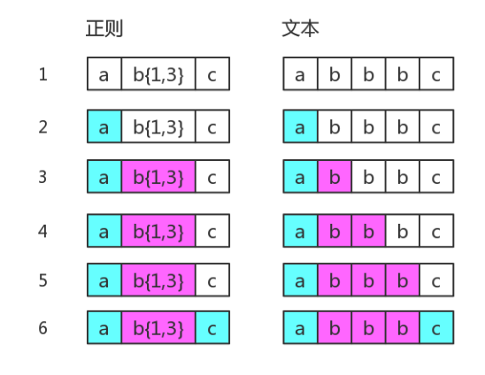

学习正则表达式，是需要懂点儿匹配原理的。

而研究匹配原理时，有两个字出现的频率比较高：“回溯”。

听起来挺高大上，事实上却是一个比较容易理解的概念。

因此，本章就简单扼要地说清楚回溯到底是什么东西

内容包括：

- 没有回溯的匹配
- 有回溯的匹配
- 常见的回溯形式

### 没有回溯的匹配

假设我们的正则是 /ab{1,3}c/

而当目标字符串是 "abbbc" 时，就没有所谓的“回溯”。其匹配过程是：


### 有回溯的匹配

如果目标字符串是"abbc"，中间就有回溯。

图中第 5 步有红颜色，表示匹配不成功。此时 b{1,3} 已经匹配到了 2 个字符 "b"，准备尝试第三个时，
结果发现接下来的字符是 "c"。那么就认为 b{1,3} 就已经匹配完毕。然后状态又回到之前的状态（即
第 6 步与第 4 步一样），最后再用子表达式 c，去匹配字符 "c"。当然，此时整个表达式匹配成功了。
图中的第 6 步，就是“回溯”。

### 常见的回溯形式

#### 贪婪量词

之前的例子都是贪婪量词相关的。比如 b{1,3}，因为其是贪婪的，尝试可能的顺序是从多往少的方向去尝
试。首先会尝试 "bbb"，然后再看整个正则是否能匹配。不能匹配时，吐出一个 "b"，即在 "bb" 的基础
上，再继续尝试。如果还不行，再吐出一个，再试。如果还不行呢？只能说明匹配失败了。

虽然局部匹配是贪婪的，但也要满足整体能正确匹配。否则，皮之不存，毛将焉附？

此时我们不禁会问，如果当多个贪婪量词挨着存在，并相互有冲突时，此时会是怎样？

答案是，先下手为强！因为深度优先搜索。测试如下：

```
var string = "12345";
var regex = /(\d{1,3})(\d{1,3})/;
console.log( string.match(regex) );
// => ["12345", "123", "45", index: 0, input: "12345"]
```

其中，前面的 \d{1,3} 匹配的是 "123"，后面的 \d{1,3} 匹配的是 "45"。

#### 惰性量词

惰性量词就是在贪婪量词后面加个问号。表示尽可能少的匹配，比如：

```
var string = "12345";
var regex = /(\d{1,3}?)(\d{1,3})/;
console.log( string.match(regex) );
// => ["1234", "1", "234", index: 0, input: "12345"]
```
